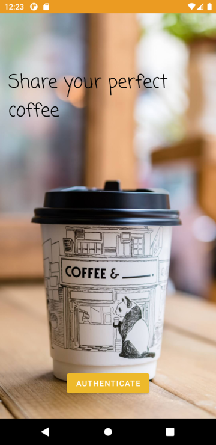
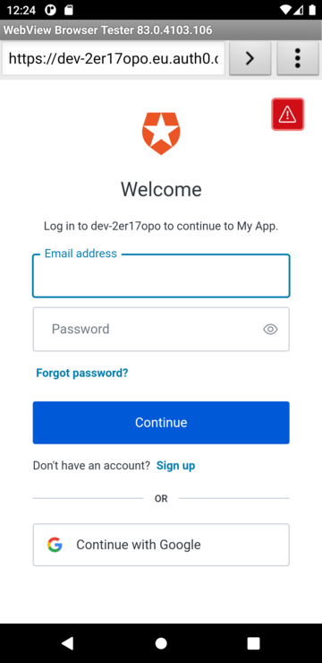
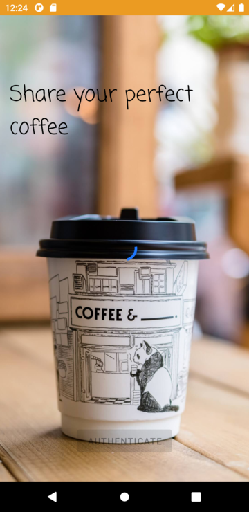
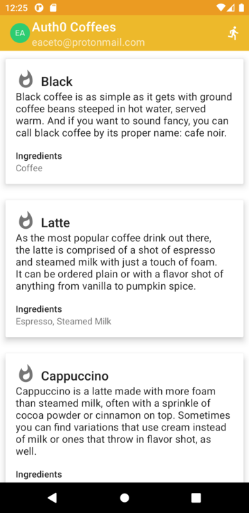
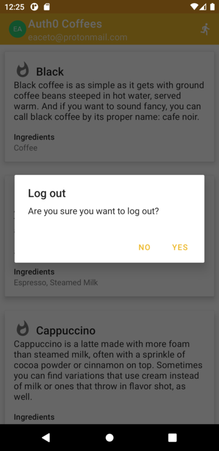

# Android Technical Exercise

[](https://opensource.org/licenses/MIT)
[](https://github.com/eaceto/okta-auth0-android-challenge/releases/tag/v1.0.1)


<!--ts-->
* [Challenge objectives](#challenge-objectives)
* [Key features](#key-features)
* [Missing features](#missing-features)
* [Known issues](#known-issues)
* [Screenshots](#screenshots)
   * [Login screen](#login-screen)
   * [External Universal Login](#external-universal-login)
   * [Loggin in](#loggin-in)
   * [Main application activity](#main-application-activity)
   * [Logout alert](#logout-alert)
* [Requirements](#requirements)
   * [Android](#android)
   * [Node.js](#nodejs)
   * [Android application](#android-application)
* [Getting started](#getting-started)
   * [Configuration](#configuration)
      * [Android application](#android-application-1)
      * [Node.js](#nodejs-1)
   * [Auth0](#auth0)
* [Dependencies](#dependencies)
   * [Android](#android-1)
   * [NodeJS](#nodejs-2)
* [Documentation](#documentation)
   * [Table of Content](#table-of-content)
<!--te-->

# Challenge objectives

Write an Android app that features user authentication to consume our Coffee API. You will be provided with a starting Android app project and a [Node API](rest/README.md) to run locally.

More information about the challenge objectives can be seen at [here](CHALLENGE.md).

# Key features

* Implements login using Auth0 Universal Login with Authorization Code and PKCE flow
* Remember user when comming back if it's already authenticated
* Implements logut
* Shows user information
* Consumes coffee information from local [Coffee API](rest/README.md)
* Shares coffee information to 3rd party apps
* Design two different item views depending on whether the coffee type is “hot” or “iced”


# Missing features

* Loading indicator while fetching list of coffees
* Error handling if there is not internet connection 
* Error handling if Coffee API is not available

# Known issues

* Android 10 emulator's Web Browser does not allow to delete cookies and session data for the login page manually. Emulator must be wiped out.

# Screenshots

## Login screen


## External Universal Login 


## Loggin in


## Main application activity



## Logout alert



# Requirements

Development environment requieres Java, for running the mobile application, and Node.js, for running the Coffee API.

## Android

* Android Studio 2020.3 (Artic Fox)
* Java version 8 or above is required.
* Android Compile SDK Level 30 is required.
* Android API Level 21+
* Build tools version 30.0.3

## Node.js

* Node.js 14.18.1 (LTS) or newer
* npm 6

## Android application

Running the (released) Android application on a emulator or mobile phone requieres Android 4.4 or newer. While using Android 10 is recommended as the development was done targeting that version.

# Getting started

The application is already setup with a custom Auth0 application. If you would like to change the target Auth0 application, the following changes should be done.

## Configuration 

### Android application

All configuration is defined in [strings.xml](app/src/main/res/values/strings.xml)

```xml
    <string name="AUTH0_SCHEME">https</string>
    <string name="AUTH0_DOMAIN">YOUR_AUTH0_DOMAIN</string>
    <string name="AUTH0_CLIENT_ID">YOUR_APPLICATION_CLIENT_ID</string>
    <string name="AUTH0_REDIRECT">com.auth0.androidexercise://universallogin/callback</string>
    <string name="COFFEE_SERVICE_URL">COFFEE_SERVICE_URL</string>
    <string name="API_AUDIENCE">coffee-api</string>
```

* **AUTH0_SCHEME** Scheme makes reference to **https** because user will be redirected to a Web Application when logging in

* **AUTH0_DOMAIN** Your Auth0 application domain

* **AUTH0_CLIENT_ID** Application ClientID obtained from Auth0 Applications Dashboard

* **AUTH0_REDIRECT** The URL defined in the Intent Filter of this application for handling authorization response. Should meet the one defined in [Manifest.xml](app/src/main/AndroidManifest.xml)

* **COFFEE_SERVICE_URL** The URL for the Coffee API (i.e.: http://localhost:3000/)

* **API_AUDIENCE** The audience defined in Auth0 Dashboard for allowing users to access Coffee API

### Node.js

In [.env](rest/.env) change **AUDIENCE** and **ISSUER_BASE_URL** to meet your configuration.

* **AUDIENCE** should be the URL where the Coffee API is available.

* **ISSUER_BASE_URL** is an URL with HTTPS as protocol and you Auth0 domain.

```bash
AUDIENCE=COFFEE_SERVICE_URL
ISSUER_BASE_URL=https://YOUR_AUTH0_DOMAIN/
```

## Auth0

1. [Create a Native Application on your Auth0 Dashboard](https://auth0.com/docs/get-started/create-apps)
2. Setup the Application **Allowed Callback URLs** to match the defined in Manifest.xml as stated above.
3. [Define an API](https://auth0.com/docs/configure/apis) taking into account that Audience should match the one defined in the Node.js service. Also, application must have a **read:coffees** scope.
4. [Assign the role](https://auth0.com/docs/authorization/rbac/rbac-users/assign-roles-to-users) **read:coffees** to the users. This can be done in different ways as described in the API

# Dependencies

## Android

* OkHttp 4.9 (as a HTTP client)
* Retrofit 2.9 (for consuming REST APIs)
* Gson 2.8 (decoding JSON with Retrofit)
* Picasso 2.8 (for retrieving user profile picture)
* Auth0  Java JWT 3.18 (for verifying and decoding JSON Web Token)
* Hilt (Dagger) 2.38 (as a dependency injection manager)
* AndroidX
* Kotlin STDLib

## NodeJS

# Documentation

## Table of Content

The index of this document is generated using (GitHub Markdown ToC](https://github.com/ekalinin/github-markdown-toc). Run the following command to update the ToC

```bash
./gh-md-toc --insert --hide-footer README.md 
```